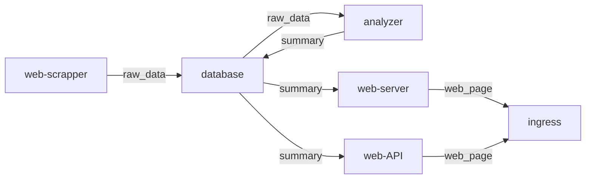

# This branch will aggregate all the other branch

## setting up (in chronological order)
- clone.sh = this will clone all the other branch
- microk8s_setup_1.sh = installs microk8s and **will reboot**
- microk8s_setup_2.sh = enable ingress and registry

# documentation
## architecture (pods)

