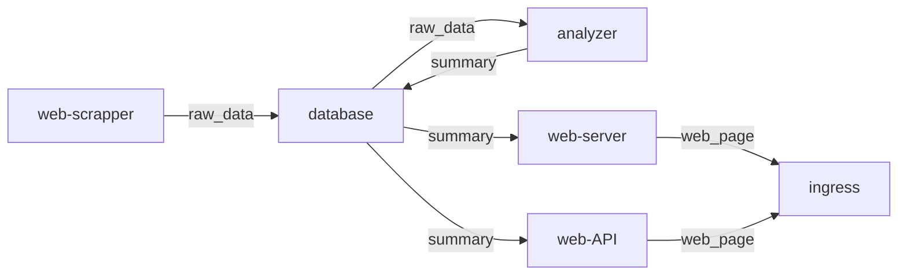

# This branch will aggregate all the other branch

## setting up (in chronological order)
### one time setup
- clone.sh = this will clone all the other branch
- microk8s_1_setup.sh = install microk8s (it will reboot)

### demo and overall maintenence (best run using source)
- microk8s_2_buildImage.sh
```
 build all image in ./images/*. the result will be in the format localhost:32000/$name:latest 
 there are also function that can podman-compose up and down
```
- microk8s_3_1(1)_pushImage.sh
```
 pushes all image (with the prefix localhost:32000) 
 it will show all image stored in the k8s registry (not containerd) along with their tags 
 it will also show every image used by deployment yaml file
```
- microk8s_4_apply.sh
```
apply all manifest in k8s_manifest and also restart deployment (such that it use the newly pushed images)

there is a function to test whether web-api-test-svc is up
```
- microk8s_5_2(4)_ingress.sh
```
it provide an interactive function to test ingress's load balancing
```
- microk8s_6_3(5+2+3)_resource.sh
```
it provide an interactive function to see effect of loadbalancing on a memory starved pod
```


# documentation
## architecture (pods)

